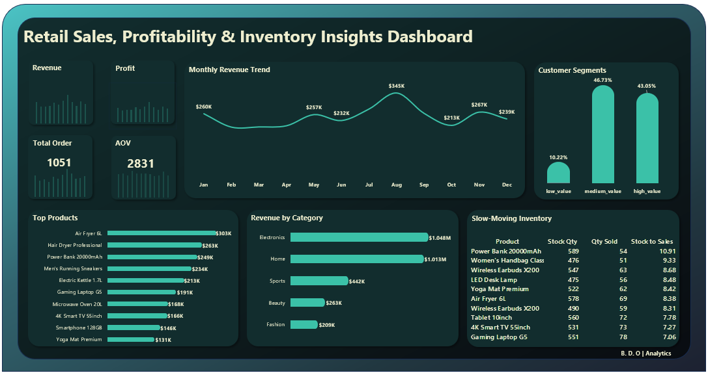

# 📊 Retail Sales, Profitability & Inventory Insights Dashboard
SQL | Data Analysis | Dashboard Design | Business Insights

## 📌 Project Overview

This project analyzes retail sales data to uncover insights into **revenue performance, product demand, customer value segmentation, and inventory risk**.

The project demonstrates a complete **data analyst workflow**, starting from raw transactional data and transforming it into meaningful business insights using SQL and dashboard visualization.

Workflow:

Raw Data → SQL Analysis → Business Metrics → Dashboard Visualization → Business Insights

---

# 🏢 Business Context

This dataset simulates a **mid-sized Nigerian e-commerce company** operating in major cities including Lagos, Abuja, Port Harcourt, Ibadan, and Kano.

The company sells products across multiple categories including:

- Electronics
- Fashion
- Home
- Sports
- Beauty

The business manages customer orders, product inventory, and warehouse stock levels while handling returned and completed orders.

However, leadership currently lacks clear visibility into how **sales performance, inventory planning, and profitability interact**, making it difficult to make informed operational and strategic decisions.

---

# 🎯 Core Business Problem

Although the company is generating consistent sales, it lacks insight into how sales performance aligns with inventory management and product profitability.

This results in several operational challenges:

- Overstocked products tying up capital
- Risk of stockouts for high-demand items
- Revenue leakage due to product returns
- Limited visibility into high-value customers
- Inefficient inventory planning

This project addresses these issues by using **SQL analysis to connect sales performance, inventory data, and profitability metrics** to uncover actionable insights.

---

# 👥 Stakeholder-Driven Business Questions

The SQL analysis in this project answers **30 business questions** designed to support different stakeholders within the company.

---

## 🧑‍💼 Sales Manager

Goal: Understand revenue drivers and improve sales performance.

Key questions include:

- Which products and categories generate the most revenue?
- How is revenue trending month-to-month?
- Who are the top customers by total spending?
- What is the average order value?
- Which cities generate the highest number of orders?

---

## 📦 Operations / Inventory Manager

Goal: Improve stock management and prevent inventory imbalance.

Key questions include:

- Which products are currently below reorder level?
- Which products have high stock but low sales volume?
- What is the inventory turnover ratio for each product?
- Are fast-selling products at risk of stockouts?
- How long has it been since each product was last restocked?

---

## 💰 Finance Manager

Goal: Monitor profitability and reduce revenue leakage.

Key questions include:

- Which products generate the highest total profit?
- What is the profit margin by product category?
- How much profit is lost due to returned orders?
- Are high-revenue products also highly profitable?
- Which categories contribute the most to overall profitability?

---

## 🧠 Executive Leadership (CEO)

Goal: Align sales growth with operational efficiency.

Key questions include:

- Are sales trends aligned with inventory availability?
- Which categories show strong demand but limited stock?
- Are resources being allocated to the most profitable products?
- How concentrated is revenue among high-value customers?
- Are there operational inefficiencies impacting profitability?

---

# 🏆 Project Scope

This project performs an **integrated analysis of sales, inventory, and profitability** using SQL.

By answering 20 structured business questions, the analysis provides insights into:

- Revenue performance
- Product demand
- Customer value segmentation
- Inventory risk
- Profitability drivers

The results are summarized in a **dashboard built in Excel**, designed to help stakeholders quickly understand business performance and make data-driven decisions.

---

# 🧰 Tools Used

| Tool | Purpose |
|-----|------|
| SQL | Data querying and analysis |
| Excel | Dashboard visualization |
| GitHub | Project documentation and portfolio |

---

# 🗂 Dataset Structure

The dataset simulates a retail business and includes the following tables:

customers – customer information  
orders – order level transactions  
order_items – products purchased per order  
products – product details  
inventory – product stock levels  

---

# 🔎 Key SQL Analysis

The SQL analysis focuses on generating business metrics such as:

- Total Revenue
- Profit
- Average Order Value
- Monthly Revenue Trends
- Top Selling Products
- Category Performance
- Customer Segmentation
- Inventory Risk Indicators
- Product Return Rates

---

# 🧠 Example SQL Queries

## KPI's

---

## Customer Segmentation Using Quartiles

---

## Monthly Revenue Trend

---

## Revenue By Category

---

## Slow-moving Products

](https://github.com/Bandele-DO/Retail-sales-sql-analysis/blob/main/Dasboard_and_Query_Screenshots/Revenue_by_Category.png)

---

## Top 10 Products 

---
# 📈 Dashboard

The final dashboard was created using **Excel** and summarizes key business insights including:

### Key Performance Indicators
- Total Revenue
- Profit
- Total Orders
- Average Order Value

### Sales Analysis
- Monthly revenue trend
- Top performing products
- Revenue by category

### Customer Insights
- Customer value segmentation

### Operational Insights
- Inventory stock-to-sales ratio
- Identification of slow-moving products

---

# 📊 Key Insights

### Electronics Lead Revenue
Electronics generated the highest revenue among all categories, making it the primary revenue driver for the business.

### High Value Customers Are a Small Segment
Customer segmentation revealed that a smaller group of high-value customers contributes significantly to overall revenue.

### Slow Moving Inventory Detected
Several products show a high stock-to-sales ratio, indicating slower inventory turnover and potential overstock risk.

---

# 🚀 Skills Demonstrated

This project demonstrates practical skills required for a **Data Analyst role**:

- SQL querying and joins
- Data aggregation and KPI development
- Window functions
- Customer segmentation
- Business metric analysis
- Dashboard design
- Data storytelling

---

# 📌 Business Recommendations

Based on the analysis, the following strategic actions are recommended:

### 1. Focus Marketing on High-Value Customers
The analysis shows that a smaller segment of **high-value customers** contributes a significant portion of total revenue.  
Targeted campaigns such as loyalty programs, personalized promotions, and exclusive offers could increase retention and lifetime value.

### 2. Optimize Inventory for Slow-Moving Products
Products with a **high stock-to-sales ratio** indicate slower demand relative to inventory levels.  
Possible actions include:
- promotional discounts
- product bundling
- inventory rebalancing

### 3. Double Down on High-Performing Categories
The **Electronics category generates the highest revenue**, suggesting strong demand.  
Expanding product variety or marketing efforts in this category could further increase sales.

### 4. Monitor Monthly Revenue Fluctuations
Revenue trends indicate seasonal fluctuations across months.  
Understanding these patterns can help with:
- demand forecasting
- inventory planning
- marketing campaign timing
---

⭐ If you found this project interesting, feel free to star the repository.
